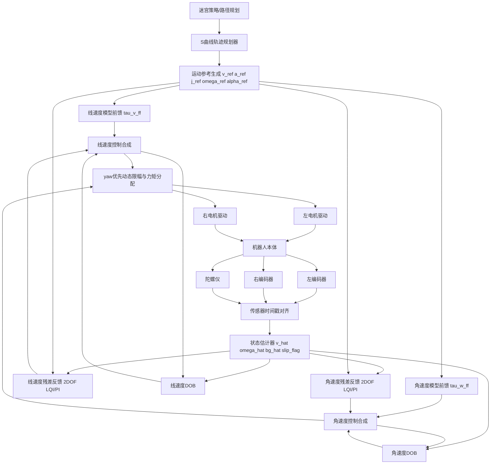

# 高速电子鼠机身线速度与角速度闭环控制器方案报告

## 0. 摘要

本文面向用于 Micromouse 竞赛的高速双轮差速机器人，给出一套可在 Infineon TC387 多核 MCU 上实时运行的机身线速度 `v` 与角速度 `ω` 解耦闭环控制方案。

方案目标不是理论最优，而是满足以下工程指标：

- 极高动态响应：角速度闭环带宽 `50-100 Hz`，线速度闭环带宽 `20-50 Hz`。
- 极低延迟：角速度反馈等效延迟尽量小于 `1 ms`，极限不超过 `3 ms`。
- 强鲁棒性：对电池压降、电机反电势、地面摩擦变化、轮胎打滑、建模误差具备补偿能力。
- MCU 可落地：全部核心算法可在 `5-10 kHz` 控制周期内使用 `float32` 完成。
- 严格解耦：不以传统“位置环 -> 左右轮速度环 -> 电流环”作为主体，而直接控制机身坐标系下的 `v` 与 `ω`。

最终推荐方案：

```text
S 曲线轨迹规划
  + 机体系 v/ω 解耦控制
  + 速度/加速度/jerk/角加速度模型前馈
  + DOB 扰动观测补偿
  + 2DOF LQI/PI 残差反馈
  + 编码器/陀螺自适应融合估计
  + yaw 优先动态力矩分配
```

推荐频率配置：

| 模块 | 推荐频率 |
|---|---:|
| PWM | `50-100 kHz` |
| 电机电流/换相/FOC | `20-50 kHz` |
| 状态估计 | `5-10 kHz` |
| v/ω 控制 | `5-10 kHz` |
| 轨迹规划 | `1-2 kHz` |
| 迷宫策略 | `100-500 Hz` |
| 日志通信 | `50-200 Hz` |

---

## 1. 系统对象与设计约束

### 1.1 控制对象

控制对象为双轮差速电子鼠：

- 左右两侧各一套高速低惯量电机和轮胎。
- 左右轮使用增量式编码器测量轮速。
- 车体中心轴线附近安装高采样率陀螺仪。
- 供电为 `2S LiPo`，母线电压随电量和负载变化明显。
- 电机驱动支持高速转矩输出，可为简化 FOC 或霍尔六步换相。

本文假设底层电机驱动尽可能表现为“力矩源”。如果驱动只能接受 PWM 或电压指令，必须在电机层增加电压、反电势、死区与母线电压补偿。

### 1.2 控制目标

控制器输出不是左右轮速度，而是左右轮力矩：

```text
τ_L = τ_v - τ_ω
τ_R = τ_v + τ_ω
```

其中：

- `τ_v`：共模力矩，用于控制机身线速度。
- `τ_ω`：差模力矩，用于控制机身角速度。

两条控制链严格解耦：

| 控制链 | 输入 | 输出 | 优先级 | 目标带宽 |
|---|---|---|---:|---:|
| 角速度闭环 | `ω_ref` | `τ_ω` | 最高 | `50-100 Hz` |
| 线速度闭环 | `v_ref` | `τ_v` | 次高 | `20-50 Hz` |

关键原则：

- 弯道中优先保证 `ω` 跟踪，不允许线速度环抢占轮胎附着力导致姿态发散。
- 反馈控制只修正残差，主要动态由轨迹规划与模型前馈承担。
- 打滑时降低对编码器角速度的信任，短时间更依赖陀螺角速度。
- 所有控制输入必须连续，禁止给速度或角速度阶跃。

---

## 2. 总体控制框图

### 2.1 主控制框图



### 2.2 控制数据流

```text
轨迹规划器
  -> v_ref, a_ref, j_ref, ω_ref, α_ref
  -> τ_v_ff, τ_ω_ff

编码器 + IMU
  -> 时间戳对齐
  -> 状态估计器
  -> v_hat, ω_hat, b_g_hat, slip_flag

v_ref - v_hat
  -> 线速度反馈
  -> 线速度 DOB
  -> τ_v_cmd

ω_ref - ω_hat
  -> 角速度反馈
  -> 角速度 DOB
  -> τ_ω_cmd

τ_v_cmd, τ_ω_cmd
  -> yaw 优先限幅
  -> τ_L, τ_R
  -> 电机驱动
```

### 2.3 与传统串级 PID 的区别

传统结构通常为：

```text
位置环 -> 左右轮速度环 -> 电机电流/PWM环
```

该结构在低速移动机器人中有效，但不适合作为高速电子鼠的主控制架构，原因如下：

| 问题 | 传统串级 PID 表现 | 本方案处理方式 |
|---|---|---|
| 急弯姿态控制 | 左右轮速度环间接产生 yaw | 直接闭环机身 `ω` |
| 打滑 | 编码器速度仍可能“看似正常” | 陀螺主导高频角速度 |
| 饱和 | 左右轮独立饱和，破坏姿态 | yaw 优先力矩分配 |
| 延迟 | 多级环节叠加相位滞后 | 前馈 + 残差反馈减少反馈负担 |
| 电池压降 | PID 积分慢慢补偿 | 电压/反电势前馈 + DOB |
| 模型扰动 | 依赖积分修正 | DOB 快速估计匹配扰动 |

---

## 3. 运动学模型

### 3.1 轮速到机身速度

定义：

| 符号 | 含义 |
|---|---|
| `r` | 轮半径 |
| `B` | 左右轮接地点间距 |
| `Ω_L` | 左轮角速度 |
| `Ω_R` | 右轮角速度 |
| `v_L` | 左轮线速度 |
| `v_R` | 右轮线速度 |
| `v` | 机身纵向线速度 |
| `ω` | 机身偏航角速度 |

左右轮线速度：

```math
v_L = r\Omega_L
```

```math
v_R = r\Omega_R
```

机身线速度与角速度：

```math
v = \frac{v_R + v_L}{2}
```

```math
\omega = \frac{v_R - v_L}{B}
```

反解为：

```math
v_L = v - \frac{B}{2}\omega
```

```math
v_R = v + \frac{B}{2}\omega
```

```math
\Omega_L = \frac{v - \frac{B}{2}\omega}{r}
```

```math
\Omega_R = \frac{v + \frac{B}{2}\omega}{r}
```

### 3.2 编码器观测

编码器离散增量为 `ΔN_L, ΔN_R`，编码器每轮机械圈计数为 `CPR_eff`，周期为 `T_s`：

```math
\Delta\theta_L = \frac{2\pi \Delta N_L}{CPR_{eff}}
```

```math
\Delta\theta_R = \frac{2\pi \Delta N_R}{CPR_{eff}}
```

```math
\Omega_{L,enc} = \frac{\Delta\theta_L}{T_s}
```

```math
\Omega_{R,enc} = \frac{\Delta\theta_R}{T_s}
```

```math
v_{enc} = \frac{r}{2}\left(\Omega_{R,enc} + \Omega_{L,enc}\right)
```

```math
\omega_{enc} = \frac{r}{B}\left(\Omega_{R,enc} - \Omega_{L,enc}\right)
```

编码器角速度在无打滑时低频可信，但在急加速、急减速和高速弯道中可能因轮胎滑移产生系统误差。

---

## 4. 动力学模型

### 4.1 力矩坐标变换

左右轮输出力矩定义为 `τ_L, τ_R`。引入共模/差模力矩：

```math
\tau_v = \frac{\tau_R + \tau_L}{2}
```

```math
\tau_\omega = \frac{\tau_R - \tau_L}{2}
```

反解：

```math
\tau_L = \tau_v - \tau_\omega
```

```math
\tau_R = \tau_v + \tau_\omega
```

这组变换是本方案解耦控制的核心。

### 4.2 线速度动力学

左右轮对地纵向合力：

```math
F_x = \frac{\tau_L + \tau_R}{r}
```

代入共模力矩：

```math
F_x = \frac{2\tau_v}{r}
```

考虑等效质量、线性阻尼、空气阻力和未知扰动：

```math
m_{eq}\dot{v} = \frac{2\tau_v}{r} - D_v v - C_d v|v| + F_{d,v}
```

因此：

```math
\dot{v} = \frac{2}{m_{eq}r}\tau_v - \frac{D_v}{m_{eq}}v - \frac{C_d}{m_{eq}}v|v| + d_v
```

其中：

```math
d_v = \frac{F_{d,v}}{m_{eq}}
```

`m_eq` 应包含车身平动质量和左右轮/电机转动惯量折算：

```math
m_{eq} = m + \frac{2J_w}{r^2}
```

如果存在减速比 `G` 和电机转子惯量 `J_m`：

```math
J_w \approx J_{wheel} + G^2J_m
```

### 4.3 角速度动力学

左右轮对车身产生偏航力矩：

```math
M_z = \frac{B}{2}\left(\frac{\tau_R}{r} - \frac{\tau_L}{r}\right)
```

代入差模力矩：

```math
M_z = \frac{B}{r}\tau_\omega
```

考虑偏航阻尼和未知扰动：

```math
J_z\dot{\omega} = \frac{B}{r}\tau_\omega - D_\omega \omega + M_{d,\omega}
```

因此：

```math
\dot{\omega} = \frac{B}{J_zr}\tau_\omega - \frac{D_\omega}{J_z}\omega + d_\omega
```

其中：

```math
d_\omega = \frac{M_{d,\omega}}{J_z}
```

### 4.4 非理想因素

模型中需要考虑的主要非理想项：

| 非理想因素 | 影响 | 处理方式 |
|---|---|---|
| 电池电压下降 | 最大力矩降低 | 动态力矩上限 + 电压前馈 |
| 电机反电势 | 高速时力矩下降 | `K_e Ω` 补偿 |
| 电机电阻发热 | 电流估算误差 | 温度/在线辨识或保守限幅 |
| 地面摩擦变化 | 最大加速度变化 | DOB + slip 检测 + 动态轨迹降额 |
| 轮胎变形 | 有效半径变化 | 实车标定 `r` 与曲率修正 |
| 空气阻力 | 高速直线误差 | `C_d v|v|` 前馈 |
| 结构振动 | 陀螺高频噪声 | 机械隔振 + notch + 合理低通 |

---

## 5. 状态空间模型

### 5.1 状态、输入与观测

状态向量：

```math
x = \begin{bmatrix} v & \omega & b_g \end{bmatrix}^T
```

输入向量：

```math
u = \begin{bmatrix} \tau_v & \tau_\omega \end{bmatrix}^T
```

观测向量推荐使用：

```math
z = \begin{bmatrix} v_{enc} & \omega_{enc} & \omega_g \end{bmatrix}^T
```

如果实现上必须只使用 `z = [v_enc, ω_imu]^T`，仍建议保留 `ω_enc` 作为打滑检测和陀螺零偏校正的辅助量。

### 5.2 连续状态方程

忽略二次风阻时的线性近似：

```math
\dot{x} = Ax + Bu + Ed
```

其中：

```math
A =
\begin{bmatrix}
-\frac{D_v}{m_{eq}} & 0 & 0 \\
0 & -\frac{D_\omega}{J_z} & 0 \\
0 & 0 & 0
\end{bmatrix}
```

```math
B =
\begin{bmatrix}
\frac{2}{m_{eq}r} & 0 \\
0 & \frac{B}{J_zr} \\
0 & 0
\end{bmatrix}
```

```math
d = \begin{bmatrix} d_v & d_\omega & w_b \end{bmatrix}^T
```

```math
E = I_3
```

含二次风阻时：

```math
\dot{v} = \frac{2}{m_{eq}r}\tau_v - \frac{D_v}{m_{eq}}v - \frac{C_d}{m_{eq}}v|v| + d_v
```

```math
\dot{\omega} = \frac{B}{J_zr}\tau_\omega - \frac{D_\omega}{J_z}\omega + d_\omega
```

```math
\dot{b}_g = w_b
```

### 5.3 观测方程

编码器和陀螺观测：

```math
v_{enc} = v + n_v
```

```math
\omega_{enc} = \omega + n_{\omega,enc} + s_\omega
```

```math
\omega_g = \omega + b_g + n_g
```

其中 `s_ω` 为轮胎打滑引起的编码器角速度系统误差。

矩阵形式：

```math
z = Hx + n
```

```math
H =
\begin{bmatrix}
1 & 0 & 0 \\
0 & 1 & 0 \\
0 & 1 & 1
\end{bmatrix}
```

---

## 6. 轨迹参考生成

### 6.1 控制输入不能阶跃

高速电子鼠的反馈闭环不应承担“把阶跃命令变成可执行运动”的任务。阶跃速度命令会引入无限大加速度需求，阶跃角速度命令会引入无限大角加速度需求，必然造成：

- 电机饱和。
- 轮胎打滑。
- 积分器 windup。
- 角速度超调。
- 低通滤波相位滞后放大。

因此轨迹层必须输出连续的：

```text
v_ref, a_ref, j_ref, ω_ref, α_ref
```

### 6.2 二阶参考模型

调试阶段可使用二阶参考模型：

```math
G(s) = \frac{\omega_n^2}{s^2 + 2\zeta\omega_ns + \omega_n^2}
```

推荐初值：

| 参数 | 线速度 | 角速度 |
|---|---:|---:|
| `ζ` | `0.9-1.1` | `0.9-1.2` |
| `ω_n` | `2π·20-40 rad/s` | `2π·50-80 rad/s` |

二阶模型优点是参数少、响应可预测；缺点是约束不如 S 曲线明确。

### 6.3 S 曲线规划

正式冲刺建议使用 S 曲线，限制速度、加速度和 jerk：

```text
|v| <= v_max
|a| <= a_max
|j| <= j_max
|ω| <= ω_max
|α| <= α_max
```

离散更新：

```math
a_{ref}[k+1] = sat(a_{ref}[k] + j_{cmd}[k]T_s, -a_{max}, a_{max})
```

```math
v_{ref}[k+1] = sat(v_{ref}[k] + a_{ref}[k+1]T_s, -v_{max}, v_{max})
```

角速度参考可由路径曲率得到：

```math
\omega_{ref} = \kappa v_{ref}
```

```math
\alpha_{ref} = \kappa a_{ref} + v_{ref}^2\frac{d\kappa}{ds}
```

若使用固定半径弯道，曲率 `κ` 为常数，则：

```math
\alpha_{ref} = \kappa a_{ref}
```

### 6.4 规划器对反馈负担的降低

轨迹规划器将大部分动态需求提前显式给出：

- `v_ref` 用于位置和速度跟踪。
- `a_ref` 直接决定线速度力矩主项。
- `j_ref` 用于补偿电机、电流环、轮胎和结构响应延迟。
- `ω_ref` 用于角速度反馈。
- `α_ref` 直接决定角速度力矩主项。

因此反馈环只需处理模型误差、扰动和估计误差，不再承担生成全部加速度的职责。

---

## 7. 线速度控制链

### 7.1 控制目标

线速度控制输入输出：

```text
输入: v_ref, a_ref, j_ref
输出: τ_v
```

指标：

| 指标 | 目标 |
|---|---:|
| 闭环带宽 | `20-50 Hz` |
| 稳态误差 | `<0.5%` |
| 加速度跟踪 | 高 |
| 减速度跟踪 | 高 |
| 与角速度环耦合 | 尽可能低 |

### 7.2 线速度前馈

由线速度动力学：

```math
m_{eq}\dot{v} = \frac{2\tau_v}{r} - D_vv - C_dv|v| + F_{d,v}
```

忽略未知扰动，令 `v_dot = a_ref`，得到物理前馈：

```math
\tau_{v,ff} = \frac{m_{eq}r}{2}a_{ref} + \frac{D_vr}{2}v_{ref} + \frac{C_dr}{2}v_{ref}|v_{ref}|
```

工程上增加 jerk 前馈：

```math
\tau_{v,ff} = k_av_{a,ref} + k_vv_{ref} + k_dv_{ref}|v_{ref}| + k_jj_{ref}
```

更明确地写为：

```math
\tau_{v,ff} = k_a a_{ref} + k_v v_{ref} + k_d v_{ref}|v_{ref}| + k_j j_{ref}
```

物理初值：

```math
k_a = \frac{m_{eq}r}{2}
```

```math
k_v = \frac{D_vr}{2}
```

```math
k_d = \frac{C_dr}{2}
```

`k_j` 没有简单刚体物理意义，主要补偿执行器和轮胎一阶滞后，可通过实验辨识。

### 7.3 线速度残差反馈

推荐使用 2DOF PI 或 LQI 形式：

```math
e_v = v_{ref} - \hat{v}
```

```math
\tau_{v,fb} = K_{pv}(\beta_vv_{ref} - \hat{v}) + K_{iv}\int e_vdt
```

其中：

- `β_v` 为设定值权重，减少指令变化时的比例冲击。
- `K_iv` 消除稳态误差。
- 积分必须带 anti-windup。

若将线速度对象近似为：

```math
P_v(s) = \frac{K_v}{s + a_v}
```

其中：

```math
K_v = \frac{2}{m_{eq}r}
```

```math
a_v = \frac{D_v}{m_{eq}}
```

按二阶闭环目标整定 PI：

```math
K_{pv} = \frac{2\zeta_v\omega_{n,v} - a_v}{K_v}
```

```math
K_{iv} = \frac{\omega_{n,v}^2}{K_v}
```

推荐初始参数范围：

| 参数 | 建议 |
|---|---:|
| `ζ_v` | `0.9-1.1` |
| `f_bw,v` | `25-40 Hz` |
| `β_v` | `0.3-0.7` |

### 7.4 线速度动态限幅

线速度环限幅必须考虑：

- 当前电池电压。
- 当前左右轮转速与反电势。
- 轮胎摩擦圆。
- 当前角速度需求。
- yaw 优先策略。

摩擦圆约束：

```math
\sqrt{a_x^2 + a_y^2} \le \mu g
```

其中：

```math
a_y = v\omega = v^2\kappa
```

线加速度可用余量：

```math
|a_x| \le \sqrt{(\mu g)^2 - a_y^2}
```

因此高速弯道中必须自动降低加减速限制，否则线速度环会抢占附着力并破坏角速度控制。

---

## 8. 角速度控制链

### 8.1 控制目标

角速度控制输入输出：

```text
输入: ω_ref, α_ref
输出: τ_ω
```

指标：

| 指标 | 目标 |
|---|---:|
| 闭环带宽 | `50-100 Hz` |
| 相位裕度 | `>=60°` |
| 稳态误差 | `≈0` |
| 峰值超调 | `<3%` |
| 有效反馈延迟 | 目标 `<1 ms`，极限 `<3 ms` |

角速度闭环是电子鼠高速稳定性的核心，应优先于线速度闭环。

### 8.2 角速度前馈

由角速度动力学：

```math
J_z\dot{\omega} = \frac{B}{r}\tau_\omega - D_\omega\omega + M_{d,\omega}
```

忽略未知扰动，令 `ω_dot = α_ref`，得到：

```math
\tau_{\omega,ff} = \frac{J_zr}{B}\alpha_{ref} + \frac{D_\omega r}{B}\omega_{ref}
```

若存在明显轮胎扭转滞后，可增加角 jerk 前馈：

```math
\tau_{\omega,ff} = k_{\alpha}\alpha_{ref} + k_\omega\omega_{ref} + k_{\dot{\alpha}}\dot{\alpha}_{ref}
```

但不建议一开始加入角 jerk 前馈，避免调参维度过高。

### 8.3 角速度反馈

推荐使用 2DOF PI 或 LQI：

```math
e_\omega = \omega_{ref} - \hat{\omega}
```

```math
\tau_{\omega,fb} = K_{p\omega}(\beta_\omega\omega_{ref} - \hat{\omega}) + K_{i\omega}\int e_\omega dt
```

其中：

- `β_ω` 可取 `0-0.5`，降低指令前沿导致的超调。
- 角速度积分器应比线速度积分器更高优先级。
- 角速度环不应使用强微分项，因为陀螺本身已经提供角速度直接测量，D 项通常只会放大噪声。

将角速度对象近似为：

```math
P_\omega(s) = \frac{K_\omega}{s + a_\omega}
```

其中：

```math
K_\omega = \frac{B}{J_zr}
```

```math
a_\omega = \frac{D_\omega}{J_z}
```

按目标二阶闭环整定：

```math
K_{p\omega} = \frac{2\zeta_\omega\omega_{n,\omega} - a_\omega}{K_\omega}
```

```math
K_{i\omega} = \frac{\omega_{n,\omega}^2}{K_\omega}
```

推荐初始参数范围：

| 参数 | 建议 |
|---|---:|
| `ζ_ω` | `0.9-1.2` |
| `f_bw,ω` | `50-70 Hz` 起步，硬件足够时 `100 Hz` |
| `β_ω` | `0-0.5` |

### 8.4 编码器角速度与陀螺角速度融合

估计关系：

```math
\omega = f(v_L, v_R, \omega_g)
```

具体为：

```math
\omega_{enc} = \frac{r}{B}(\Omega_R - \Omega_L)
```

```math
\omega_g = \omega + b_g + n_g
```

融合原则：

- 高频角速度使用陀螺，因为延迟低、带宽高，不受轮胎局部滑移直接影响。
- 低频角速度使用编码器修正陀螺零偏。
- 打滑时降低甚至冻结编码器角速度对 `ω_hat` 和 `b_g_hat` 的影响。

工程互补形式：

```math
\hat{\omega} = (\omega_g - \hat{b}_g) + LPF(\omega_{enc}) - LPF(\omega_g - \hat{b}_g)
```

该式等价于：

- 陀螺提供高频。
- 编码器提供低频。
- 两者在交叉频率附近平滑过渡。

推荐交叉频率：

```text
10-30 Hz
```

陀螺零偏更新：

```math
e_b = LPF((\omega_g - \hat{b}_g) - \omega_{enc})
```

```math
\hat{b}_g[k+1] = \hat{b}_g[k] + K_b e_b T_s
```

零偏更新门控条件：

```text
slip_flag = false
|τ_ω| 未饱和
|ω_g - b_g_hat - ω_enc| < threshold
|α_ref| 不过大
```

---

## 9. 扰动观测器 DOB

### 9.1 扰动定义

希望估计的扰动包括：

```math
d = \tau_f + \tau_{slip} + \tau_b + \tau_{model}
```

对应物理意义：

| 扰动 | 来源 |
|---|---|
| `τ_f` | 轮胎/轴承/地面摩擦 |
| `τ_slip` | 打滑导致的等效力矩损失 |
| `τ_b` | 电池压降、驱动输出不足 |
| `τ_model` | 质量、惯量、阻尼、轮径误差 |

DOB 的作用是估计“模型逆推出所需输入”和“实际控制输入”之间的差。

### 9.2 连续 DOB 推导

名义对象：

```math
y = P_n(s)(u + d)
```

则：

```math
P_n^{-1}(s)y = u + d
```

理想扰动估计：

```math
d = P_n^{-1}(s)y - u
```

由于 `P_n^-1` 通常会放大噪声，必须加入低通 Q 滤波器：

```math
\hat{d} = Q(s)(P_n^{-1}(s)y - u)
```

补偿控制律：

```math
u = u_{ff} + u_{fb} - \hat{d}
```

### 9.3 线速度 DOB

一阶名义对象：

```math
P_{n,v}(s) = \frac{K_v}{s + a_v}
```

逆模型：

```math
P_{n,v}^{-1}(s)y = \frac{\dot{y} + a_vy}{K_v}
```

线速度扰动估计：

```math
\hat{d}_v = Q_v(s)\left(\frac{\dot{\hat{v}} + a_v\hat{v}}{K_v} - \tau_v\right)
```

### 9.4 角速度 DOB

一阶名义对象：

```math
P_{n,\omega}(s) = \frac{K_\omega}{s + a_\omega}
```

角速度扰动估计：

```math
\hat{d}_\omega = Q_\omega(s)\left(\frac{\dot{\hat{\omega}} + a_\omega\hat{\omega}}{K_\omega} - \tau_\omega\right)
```

### 9.5 Q 滤波器带宽

Q 滤波器可用一阶或二阶低通。

一阶：

```math
Q(s) = \frac{\omega_Q}{s + \omega_Q}
```

二阶：

```math
Q(s) = \frac{\omega_Q^2}{s^2 + 2\zeta_Q\omega_Qs + \omega_Q^2}
```

推荐：

| DOB | Q 带宽 |
|---|---:|
| 线速度 DOB | `60-100 Hz` |
| 角速度 DOB | `120-180 Hz` |

带宽选择原则：

```text
Q 带宽 > 对应闭环带宽
Q 带宽 < 电机力矩环带宽 / 3
Q 带宽 < 结构共振频率 / 3
Q 带宽不能明显放大编码器量化噪声和陀螺振动
```

### 9.6 DOB 使用注意

DOB 不应替代反馈，也不应替代前馈。合理分工为：

```text
轨迹规划: 限制系统输入可实现性
前馈: 处理已知模型动态
DOB: 处理低中频匹配扰动
反馈: 处理残差误差和稳态误差
限幅: 保证物理约束和稳定性
```

---

## 10. 状态估计器设计

### 10.1 估计目标

估计状态：

```math
x = \begin{bmatrix} v & \omega & b_g \end{bmatrix}^T
```

输入：

```math
u = \begin{bmatrix} \tau_v & \tau_\omega \end{bmatrix}^T
```

观测：

```math
z = \begin{bmatrix} v_{enc} & \omega_{imu} \end{bmatrix}^T
```

工程实现中建议额外使用：

```math
\omega_{enc}
```

用于陀螺零偏校正与打滑检测。

### 10.2 EKF、ESKF、UKF、互补滤波对比

| 方法 | 优点 | 缺点 | 结论 |
|---|---|---|---|
| Complementary | 极低延迟、参数少、鲁棒、易调 | 统计最优性较弱 | 首选工程落地方案 |
| 线性 KF | 可使用噪声协方差自适应，状态清晰 | 需要维护矩阵与协方差 | 推荐极限性能版本 |
| EKF | 可处理非线性模型 | 本系统非线性不强，复杂度偏高 | 可用但不是必须 |
| ESKF | 适合姿态惯导误差状态 | 单轴 yaw 速度估计收益有限 | 不推荐作为主方案 |
| UKF | 非线性强时精度好 | 计算量和调试成本高 | 不推荐 10 kHz 内环 |

最终建议：

```text
第一版: 自适应互补滤波
性能版: 3状态线性KF + slip自适应R矩阵
```

### 10.3 自适应互补滤波实现

陀螺去零偏：

```math
\omega_{gyro} = \omega_g - \hat{b}_g
```

互补融合：

```math
\hat{\omega} = \omega_{gyro} + LPF(\omega_{enc}) - LPF(\omega_{gyro})
```

线速度估计：

```math
\hat{v} = LPF(v_{enc})
```

如果要降低线速度延迟，可使用模型预测补偿：

```math
\hat{v}_{pred} = \hat{v} + T_d\hat{\dot{v}}
```

```math
\hat{\omega}_{pred} = \hat{\omega} + T_d\hat{\dot{\omega}}
```

反馈控制使用预测值：

```text
v_fb = v_hat_pred
ω_fb = ω_hat_pred
```

### 10.4 线性 KF 实现

离散模型：

```math
x_{k+1} = A_dx_k + B_du_k + w_k
```

```math
z_k = Hx_k + n_k
```

小周期下可使用一阶离散化：

```math
A_d \approx I + AT_s
```

```math
B_d \approx BT_s
```

预测：

```math
\hat{x}_{k|k-1} = A_d\hat{x}_{k-1|k-1} + B_du_{k-1}
```

```math
P_{k|k-1} = A_dP_{k-1|k-1}A_d^T + Q
```

更新：

```math
K_k = P_{k|k-1}H^T(HP_{k|k-1}H^T + R)^{-1}
```

```math
\hat{x}_{k|k} = \hat{x}_{k|k-1} + K_k(z_k - H\hat{x}_{k|k-1})
```

```math
P_{k|k} = (I - K_kH)P_{k|k-1}
```

打滑自适应：

```math
r_{slip} = \omega_{enc} - (\omega_g - \hat{b}_g)
```

当：

```math
|r_{slip}| > \gamma\sigma_r
```

则：

```text
增大 R_ωenc
冻结或减慢 b_g 更新
降低 a_max、j_max、τ_v_max
角速度反馈更信任陀螺
```

---

## 11. 电机与驱动补偿

### 11.1 电机模型

单电机电气方程：

```math
V = Ri + L\frac{di}{dt} + K_e\Omega
```

力矩方程：

```math
\tau = K_ti
```

若底层接受电流命令：

```math
i_{cmd} = \frac{\tau_{cmd}}{K_t}
```

若底层接受电压或 PWM 命令：

```math
V_{cmd} = R\frac{\tau_{cmd}}{K_t} + L\frac{1}{K_t}\frac{d\tau_{cmd}}{dt} + K_e\Omega
```

PWM 占空比：

```math
duty = \frac{V_{cmd}}{V_{bat}}
```

### 11.2 高速力矩上限

高速时反电势占用母线电压，最大电流下降：

```math
i_{max}(\Omega) \approx \frac{V_{bat} - K_e|\Omega|}{R}
```

对应最大力矩：

```math
\tau_{max}(\Omega, V_{bat}) = K_t i_{max}(\Omega)
```

实际还需受驱动电流限制：

```math
\tau_{max} = K_t\min(i_{driver,max}, i_{thermal,max}, i_{voltage,max})
```

### 11.3 六步换相与简化 FOC

| 驱动方式 | 优点 | 缺点 | 建议 |
|---|---|---|---|
| 霍尔六步 | 实现简单，计算轻 | 转矩脉动、低速不细腻 | 可用，但需换相提前角和死区补偿 |
| 简化 FOC | 转矩平滑，高速可控 | 实现和采样复杂 | 推荐用于极限性能 |
| 完整 FOC | 性能最佳 | 开发成本高 | 如果已有硬件和代码，应优先使用 |

无论何种方式，机身控制器都应尽量认为底层是力矩源。若底层不是力矩源，则必须把电压补偿和力矩限幅做好，否则上层 DOB 和 PI 会承担过多非线性误差。

---

## 12. 动态力矩分配与限幅

### 12.1 基本分配

```math
\tau_L = \tau_v - \tau_\omega
```

```math
\tau_R = \tau_v + \tau_\omega
```

### 12.2 可行域

左右轮力矩约束：

```math
\tau_{L,min} \le \tau_v - \tau_\omega \le \tau_{L,max}
```

```math
\tau_{R,min} \le \tau_v + \tau_\omega \le \tau_{R,max}
```

给定 `τ_ω` 时，`τ_v` 可行区间为：

```math
\tau_v \in [\tau_{L,min} + \tau_\omega, \tau_{L,max} + \tau_\omega]
```

```math
\tau_v \in [\tau_{R,min} - \tau_\omega, \tau_{R,max} - \tau_\omega]
```

取交集：

```math
\tau_{v,min}^{allow} = \max(\tau_{L,min} + \tau_\omega, \tau_{R,min} - \tau_\omega)
```

```math
\tau_{v,max}^{allow} = \min(\tau_{L,max} + \tau_\omega, \tau_{R,max} - \tau_\omega)
```

### 12.3 yaw 优先策略

策略：

```text
1. 先根据左右轮能力限制 τ_ω，但尽可能保留角速度控制能力。
2. 再在剩余可行域内限制 τ_v。
3. 线速度积分器根据实际 τ_v 回算 anti-windup。
4. 角速度积分器仅在 τ_ω 严重饱和时回算。
```

这样在高速弯道中会牺牲一点线速度跟踪，但保住姿态稳定。

### 12.4 anti-windup

回算形式：

```math
I[k+1] = I[k] + e[k]T_s + K_{aw}(u_{sat} - u_{raw})T_s
```

线速度环 `K_aw` 可较大，角速度环 `K_aw` 应保守，避免急弯时过度削弱 yaw 积分补偿。

---

## 13. 控制器类型比较与最终选择

### 13.1 PID

优点：

- 简单。
- 易于快速调通。
- MCU 负担极小。

缺点：

- 对电池电压、反电势、摩擦、打滑等扰动没有显式处理。
- 高带宽下对延迟和噪声敏感。
- 普通串级 PID 会把机身 yaw 控制变成左右轮速度误差的间接结果。

结论：

```text
普通串级 PID 不推荐作为主方案。
2DOF PI 可作为残差反馈环使用。
```

### 13.2 LQR/LQI

优点：

- 基于状态空间，适合 `v/ω` 解耦或 MIMO 扩展。
- 参数有明确权重意义。
- LQI 可自然消除稳态误差。

缺点：

- 依赖模型。
- 对约束处理不如 MPC。
- 实际调参仍需结合频域指标。

结论：

```text
推荐用于反馈增益设计。
在本系统的一阶解耦近似下，LQI 和 2DOF PI 实现可等价落地。
```

### 13.3 ADRC

优点：

- 把模型误差和外部扰动作为总扰动估计。
- 对模型依赖较弱。

缺点：

- ESO 高带宽时噪声敏感。
- 参数物理意义不如 DOB 明确。
- 与陀螺高频噪声、编码器量化噪声共同存在时，调试难度较高。

结论：

```text
可用，但不是首选。
如果团队熟悉 ADRC，可将 ESO 带宽设得保守，作为 DOB 的替代实现。
```

### 13.4 DOB

优点：

- 对匹配扰动补偿效果好。
- 参数由名义对象和 Q 滤波器决定，物理意义清晰。
- 与模型前馈和 PI 残差反馈配合自然。

缺点：

- 需要名义模型。
- Q 带宽过高会放大噪声和未建模高频动态。

结论：

```text
强烈推荐作为本系统鲁棒性核心。
```

### 13.5 MPC

优点：

- 处理约束最自然。
- 可统一考虑速度、角速度、轮胎附着和电机饱和。

缺点：

- 10 kHz 内环实时优化成本较高。
- 标定与故障诊断复杂。
- 对高速电子鼠主速度环来说收益不一定抵消复杂度。

结论：

```text
不推荐放在 5-10 kHz 内环。
可用于 1 kHz 轨迹规划层或离线速度剖面优化。
```

### 13.6 最终控制器选择

最终推荐：

```text
轨迹层: S 曲线 + 摩擦圆约束 + 曲率前馈
前馈层: 速度/加速度/jerk + 角速度/角加速度
扰动层: 一阶名义模型 DOB
反馈层: 2DOF LQI/PI 残差反馈
估计层: 自适应互补滤波，性能版升级 3状态 KF
分配层: yaw 优先动态力矩限幅
```

---

## 14. 离散实现公式

### 14.1 基本采样周期

```text
T_ctrl = 0.0001-0.0002 s
```

即控制频率为：

```text
5-10 kHz
```

### 14.2 一阶低通

连续截止频率 `f_c` 对应离散系数：

```math
\alpha = 1 - e^{-2\pi f_cT_s}
```

更新公式：

```math
y_f[k] = y_f[k-1] + \alpha(x[k] - y_f[k-1])
```

### 14.3 脏微分

```math
\dot{x}_{raw}[k] = \frac{x[k] - x[k-1]}{T_s}
```

```math
\dot{x}_f[k] = \dot{x}_f[k-1] + \alpha_d(\dot{x}_{raw}[k] - \dot{x}_f[k-1])
```

### 14.4 2DOF PI

```math
e[k] = r[k] - y[k]
```

```math
I[k] = sat(I[k-1] + e[k]T_s, I_{min}, I_{max})
```

```math
u_{fb}[k] = K_p(\beta r[k] - y[k]) + K_iI[k]
```

### 14.5 DOB

一阶对象：

```math
P_n(s) = \frac{K}{s + a}
```

离散实现：

```math
\dot{y}_f[k] = LPF\left(\frac{y[k] - y[k-1]}{T_s}\right)
```

```math
d_{raw}[k] = \frac{\dot{y}_f[k] + ay[k]}{K} - u_{delay}[k]
```

```math
\hat{d}[k] = LPF_Q(d_{raw}[k])
```

控制输出：

```math
u[k] = u_{ff}[k] + u_{fb}[k] - \hat{d}[k]
```

### 14.6 预测补偿

如果测量和滤波总延迟为 `T_d`：

```math
y_{pred}[k] = y_{hat}[k] + T_d\dot{y}_{hat}[k]
```

角速度反馈使用：

```math
\omega_{fb}[k] = \hat{\omega}[k] + T_d\hat{\dot{\omega}}[k]
```

线速度反馈使用：

```math
v_{fb}[k] = \hat{v}[k] + T_d\hat{\dot{v}}[k]
```

### 14.7 单周期控制合成

```math
\tau_{v,cmd} = \tau_{v,ff} + \tau_{v,fb} - \hat{d}_v
```

```math
\tau_{\omega,cmd} = \tau_{\omega,ff} + \tau_{\omega,fb} - \hat{d}_\omega
```

```math
\tau_L = \tau_{v,cmd} - \tau_{\omega,cmd}
```

```math
\tau_R = \tau_{v,cmd} + \tau_{\omega,cmd}
```

---

## 15. 高频稳定性分析

### 15.1 延迟对相位裕度的影响

纯延迟 `T_d` 在频率 `f_c` 处造成相位损失：

```math
\phi_{delay} = -360^\circ f_cT_d
```

若角速度闭环目标带宽 `100 Hz`，总延迟 `3 ms`：

```math
\phi_{delay} = -360^\circ \cdot 100 \cdot 0.003 = -108^\circ
```

这几乎不可能保持 `>=60°` 相位裕度。

因此：

```text
若 T_d ≈ 3 ms，角速度带宽应限制在 30-50 Hz。
若希望角速度带宽达到 100 Hz，T_d 应尽量 <= 0.8 ms。
```

### 15.2 滤波器相位损失

一阶低通在频率 `f` 处相位为：

```math
\phi_{lpf} = -\arctan\left(\frac{f}{f_{filter}}\right)
```

如果在 `100 Hz` 闭环中使用 `100 Hz` 低通，则单个低通已经带来约 `-45°` 相位滞后，不能接受。

建议：

```text
陀螺低通: 500-1000 Hz
编码器速度低通: 200-500 Hz
互补交叉频率: 10-30 Hz
结构振动: 用 notch，而不是盲目降低总体低通截止频率
```

### 15.3 采样频率要求

`10 kHz` 控制频率对 `100 Hz` 闭环带宽的频率比例为 `100:1`，采样本身足够。真正瓶颈是：

- IMU 采样和数字滤波延迟。
- 编码器速度估计窗口延迟。
- SPI/DMA 数据时间戳误差。
- 电机力矩响应延迟。
- 控制任务调度抖动。

### 15.4 结构共振与 notch

若陀螺频谱中存在明显机械共振峰，应使用二阶 notch：

```math
H_{notch}(s) = \frac{s^2 + 2\zeta_z\omega_ns + \omega_n^2}{s^2 + 2\zeta_p\omega_ns + \omega_n^2}
```

其中：

```text
ζ_z < ζ_p
```

notch 只应针对明确测得的共振频率，不应滥用。

### 15.5 闭环带宽分配

推荐频率层级：

```text
电流/力矩环带宽 > DOB Q带宽 > 速度闭环带宽 > 轨迹规划带宽
```

角速度链建议：

```text
电机力矩环: 500-1000 Hz 以上等效带宽
角速度 DOB Q: 120-180 Hz
角速度闭环: 50-100 Hz
轨迹角速度变化主频: <30-50 Hz
```

线速度链建议：

```text
线速度 DOB Q: 60-100 Hz
线速度闭环: 20-50 Hz
轨迹线速度变化主频: <10-25 Hz
```

---

## 16. TC387 实时线程架构

### 16.1 多核任务划分

| 任务 | 频率 | 推荐核心 | 优先级 |
|---|---:|---|---:|
| PWM 产生 | `50-100 kHz` | GTM/TOM 硬件 | 最高 |
| ADC/电流采样 | `20-50 kHz` | Core0 ISR | 最高 |
| FOC/换相/保护 | `20-50 kHz` | Core0 ISR | 最高 |
| 编码器采样 | `10-20 kHz` | Core1 ISR/硬件 | 高 |
| IMU SPI DMA | `5-10 kHz` | Core1 DMA/ISR | 高 |
| 状态估计 | `5-10 kHz` | Core1 | 高 |
| v/ω 控制 + DOB | `5-10 kHz` | Core1 | 高 |
| 力矩分配 | `5-10 kHz` | Core1 | 高 |
| 轨迹规划 | `1-2 kHz` | Core2 | 中 |
| 迷宫策略 | `100-500 Hz` | Core2 | 中 |
| 日志通信 | `50-200 Hz` | Core2/低优先级 | 低 |

### 16.2 实时原则

必须遵守：

- 控制 ISR 内禁止动态内存分配。
- 控制 ISR 内禁止阻塞等待 SPI/I2C。
- 所有传感器数据必须带时间戳。
- 参数更新使用双缓冲或锁-free 结构。
- 日志不可阻塞控制环。
- 控制环输入使用上一周期完整一致的数据快照。
- 估计器和控制器尽量固定执行时间。

### 16.3 数据同步

推荐结构：

```text
IMU DMA 完成 -> 写入 imu_buffer + timestamp
编码器定时器 -> 读取 delta_count + timestamp
控制 tick -> 取最近同步快照 -> 状态估计 -> 控制输出
```

若 IMU 和控制周期不同步，需要做时间对齐或短预测。

---

## 17. MCU 代码框架

### 17.1 数据结构

```c
typedef struct {
    float r;
    float B;
    float m_eq;
    float Jz;
    float Dv;
    float Dw;
    float Cd;
    float Ts;
} RobotParam;

typedef struct {
    float v;
    float w;
    float bg;
    float slip;
} StateEstimate;

typedef struct {
    float v;
    float a;
    float j;
    float w;
    float alpha;
} MotionRef;

typedef struct {
    float kp;
    float ki;
    float beta;
    float integ;
    float integ_min;
    float integ_max;
    float kaw;
} AxisFb;

typedef struct {
    float K;
    float a;
    float fq;
    float d_hat;
    float y_prev;
    float ydot_f;
} Dob;

typedef struct {
    float tau_v;
    float tau_w;
    float tau_l;
    float tau_r;
} TorqueCmd;
```

### 17.2 基础滤波

```c
static float lpf_update(float y, float x, float fc, float Ts)
{
    float alpha = 1.0f - expf(-6.283185307f * fc * Ts);
    return y + alpha * (x - y);
}

static float clampf(float x, float lo, float hi)
{
    if (x < lo) return lo;
    if (x > hi) return hi;
    return x;
}
```

### 17.3 2DOF PI

```c
static float axis_pi_update(AxisFb *c, float ref, float y, float Ts)
{
    float e = ref - y;
    c->integ = clampf(c->integ + e * Ts, c->integ_min, c->integ_max);
    return c->kp * (c->beta * ref - y) + c->ki * c->integ;
}

static void axis_pi_anti_windup(AxisFb *c, float u_raw, float u_sat, float Ts)
{
    c->integ += c->kaw * (u_sat - u_raw) * Ts;
    c->integ = clampf(c->integ, c->integ_min, c->integ_max);
}
```

### 17.4 DOB

```c
static float dob_update(Dob *dob, float y, float u_delay, float Ts)
{
    float dy_raw = (y - dob->y_prev) / Ts;
    dob->y_prev = y;

    dob->ydot_f = lpf_update(dob->ydot_f, dy_raw, dob->fq, Ts);

    float raw_d = (dob->ydot_f + dob->a * y) / dob->K - u_delay;
    dob->d_hat = lpf_update(dob->d_hat, raw_d, dob->fq, Ts);

    return dob->d_hat;
}
```

### 17.5 单周期控制主函数

```c
void control_10khz_isr(void)
{
    SensorRaw sensor = sensor_read_timestamped();
    MotionRef ref = planner_get_ref_snapshot();
    StateEstimate x = estimator_update(sensor);

    float tauv_ff = kv * ref.v
                  + ka * ref.a
                  + kj * ref.j
                  + kd * ref.v * fabsf(ref.v);

    float tauw_ff = (param.Jz * param.r / param.B) * ref.alpha
                  + (param.Dw * param.r / param.B) * ref.w;

    float v_fb_signal = x.v;
    float w_fb_signal = x.w;

    float tauv_fb = axis_pi_update(&ctrl_v, ref.v, v_fb_signal, param.Ts);
    float tauw_fb = axis_pi_update(&ctrl_w, ref.w, w_fb_signal, param.Ts);

    float dv_hat = dob_update(&dob_v, x.v, last_tauv_cmd, param.Ts);
    float dw_hat = dob_update(&dob_w, x.w, last_tauw_cmd, param.Ts);

    float tauv_raw = tauv_ff + tauv_fb - dv_hat;
    float tauw_raw = tauw_ff + tauw_fb - dw_hat;

    TorqueCmd cmd = allocate_yaw_priority(tauv_raw, tauw_raw, motor_limit_get(), x.slip);

    axis_pi_anti_windup(&ctrl_v, tauv_raw, cmd.tau_v, param.Ts);
    axis_pi_anti_windup(&ctrl_w, tauw_raw, cmd.tau_w, param.Ts);

    motor_set_torque_left(cmd.tau_l);
    motor_set_torque_right(cmd.tau_r);

    last_tauv_cmd = cmd.tau_v;
    last_tauw_cmd = cmd.tau_w;
}
```

### 17.6 yaw 优先分配框架

```c
TorqueCmd allocate_yaw_priority(float tauv_raw, float tauw_raw,
                                MotorLimit lim, float slip)
{
    TorqueCmd out;

    float tauw = clampf(tauw_raw, -lim.tauw_max, lim.tauw_max);

    if (slip > 0.5f) {
        tauv_raw *= lim.slip_tauv_scale;
    }

    float tauv_min_l = lim.taul_min + tauw;
    float tauv_max_l = lim.taul_max + tauw;
    float tauv_min_r = lim.taur_min - tauw;
    float tauv_max_r = lim.taur_max - tauw;

    float tauv_min = fmaxf(tauv_min_l, tauv_min_r);
    float tauv_max = fminf(tauv_max_l, tauv_max_r);
    float tauv = clampf(tauv_raw, tauv_min, tauv_max);

    out.tau_v = tauv;
    out.tau_w = tauw;
    out.tau_l = tauv - tauw;
    out.tau_r = tauv + tauw;

    return out;
}
```

---

## 18. 参数表

### 18.1 必须实测参数

| 参数 | 含义 | 获取方式 |
|---|---|---|
| `m` | 车体质量 | 称重 |
| `r` | 有效轮半径 | 标定直线距离 |
| `B` | 有效轮距 | 原地旋转标定 |
| `J_z` | 偏航转动惯量 | CAD 或扭摆实验 |
| `K_t` | 电机力矩常数 | 数据手册或测功 |
| `K_e` | 反电势常数 | 空载转速测试 |
| `R` | 相电阻/等效电阻 | 四线测量或辨识 |
| `L` | 电感 | LCR 或驱动辨识 |
| `CPR_eff` | 编码器有效计数 | 编码器规格与倍频 |
| `gyro_scale` | 陀螺比例 | 标定 |
| `gyro_bias` | 陀螺零偏 | 静止采样 |
| `gyro_noise` | 陀螺噪声 | 静止 Allan/方差测试 |

### 18.2 初始控制参数

| 参数 | 初始值 |
|---|---:|
| `PWM` | `80 kHz` |
| 电流/力矩环 | `20-40 kHz` |
| 状态估计 | `10 kHz` |
| 控制环 | `10 kHz` |
| 轨迹规划 | `1-2 kHz` |
| `f_bw,ω` | `50-70 Hz` 起步 |
| `f_bw,v` | `25-40 Hz` |
| `ζ_ω` | `0.9-1.2` |
| `ζ_v` | `0.9-1.1` |
| `β_ω` | `0-0.5` |
| `β_v` | `0.3-0.7` |
| 陀螺低通 | `500-1000 Hz` |
| 编码器速度低通 | `200-500 Hz` |
| 互补交叉频率 | `10-30 Hz` |
| 陀螺零偏更新 | `0.1-2 Hz` |
| `DOB Q_v` | `60-100 Hz` |
| `DOB Q_ω` | `120-180 Hz` |

### 18.3 性能目标

| 指标 | 目标 |
|---|---:|
| 角速度带宽 | `50-100 Hz` |
| 线速度带宽 | `20-50 Hz` |
| 相位裕度 | `>=60°` |
| 角速度超调 | `<3%` |
| 线速度稳态误差 | `<0.5%` |
| 有效角速度反馈延迟 | 目标 `<1 ms`，极限 `<3 ms` |

---

## 19. 参数整定流程

### 19.1 硬件与传感器标定

1. 标定编码器方向，确保前进时左右轮速度符号一致。
2. 标定陀螺方向，确保左转/右转符号与 `ω_enc` 一致。
3. 静止采样陀螺 `30-120 s`，估计零偏、噪声方差和温漂。
4. 低速直线行驶固定距离，标定有效轮半径 `r`。
5. 原地旋转固定角度，标定有效轮距 `B`。
6. 测量电池电压采样比例与电流采样比例。

### 19.2 电机层调试

1. 单电机开环验证方向。
2. 调通霍尔六步或 FOC。
3. 验证电流采样和过流保护。
4. 标定死区、摩擦启动电压、反电势系数。
5. 让底层尽量表现为力矩源。

### 19.3 模型辨识

1. 低速小力矩直线加速，辨识 `m_eq` 和 `D_v`。
2. 低速原地旋转，辨识 `J_z` 和 `D_ω`。
3. 高速直线稳态测试，辨识 `C_d`。
4. 对比 `v_enc`、`ω_enc`、`ω_g - b_g` 的一致性。

### 19.4 角速度环整定

1. 关闭线速度环或固定低速。
2. 只开角速度前馈和反馈，不开 DOB。
3. 从 `30 Hz` 带宽开始，逐步提高到 `50-70 Hz`。
4. 确认阶跃参考经过二阶模型或 S 曲线，不直接阶跃。
5. 检查超调、振铃、控制输出饱和和陀螺频谱。
6. 打开角速度 DOB，Q 从低到高增加，噪声明显进入控制量后回退 `20-30%`。
7. 硬件延迟足够低时再尝试 `80-100 Hz`。

### 19.5 线速度环整定

1. 保持角速度环已稳定。
2. 只跑直线，打开线速度前馈。
3. 调 `k_a` 使加速度跟踪接近。
4. 调 `k_v` 和 `k_d` 使匀速误差减小。
5. 加入 2DOF PI 残差反馈，带宽从 `15-20 Hz` 开始。
6. 提高到 `25-40 Hz`，一般不要超过角速度环带宽的一半。
7. 打开线速度 DOB，观察低频扰动补偿和高频噪声。

### 19.6 联合高速调试

1. 开启 yaw 优先限幅。
2. 测试直线急加速、急减速。
3. 测试固定半径弯道。
4. 测试 S 弯和连续弯。
5. 逐步提高 `v_max, a_max, j_max, ω_max, α_max`。
6. 记录 slip_flag、DOB 输出、饱和比例和轨迹误差。
7. 若弯中失稳，优先降低线速度加速度和 jerk，而不是先降角速度带宽。

---

## 20. 风险分析与对策

| 风险 | 表现 | 对策 |
|---|---|---|
| 反馈延迟过大 | 高频振荡、相位裕度不足 | 减少滤波延迟、时间戳对齐、预测补偿、降低带宽 |
| 陀螺机械振动 | `ω_hat` 噪声大，控制输出抖动 | 机械隔振、频谱分析、notch、提高安装刚度 |
| 编码器量化噪声 | 低速速度跳变 | 定时器捕获、短窗滤波、低速特殊处理 |
| 高速打滑 | `ω_enc` 与陀螺差异变大 | slip 检测、降低编码器权重、动态降额 |
| 电池压降 | 加速无力、闭环积分变大 | 母线电压补偿、动态力矩上限、DOB |
| 反电势饱和 | 高速阶段无法继续加速 | 速度相关力矩上限、轨迹提前降加速度 |
| 六步换相转矩脉动 | 角速度纹波 | 简化 FOC、换相提前角、DOB/滤波 |
| 轮胎变形 | 曲率误差 | 实车标定有效轮径和轮距 |
| 积分 windup | 饱和后恢复慢或过冲 | anti-windup、yaw 优先限幅 |
| 参数漂移 | 长时间运行性能变化 | 在线温度修正、定期重标定、保守限幅 |

---

## 21. 推荐落地版本

### 21.1 第一阶段：稳定可跑版本

```text
轨迹: S 曲线
估计: 自适应互补滤波
角速度: 角加速度前馈 + 2DOF PI
线速度: a/v 前馈 + 2DOF PI
DOB: 暂不开或低带宽
分配: yaw 优先限幅
频率: 控制 5 kHz，估计 5 kHz
```

目标：安全跑通高速直线、减速和中速弯。

### 21.2 第二阶段：高性能版本

```text
轨迹: S 曲线 + 摩擦圆约束
估计: 自适应互补滤波 + slip 自适应
角速度: α 前馈 + DOB + 2DOF PI/LQI
线速度: v/a/j 前馈 + DOB + 2DOF PI/LQI
分配: yaw 优先 + 电压/反电势动态限幅
频率: 控制 10 kHz，估计 10 kHz
```

目标：高速冲刺、精准减速、急弯无明显超调。

### 21.3 第三阶段：极限冲刺版本

```text
轨迹: 离线/在线速度剖面优化 + S 曲线执行
估计: 3状态 KF + 自适应 R + 陀螺温漂补偿
角速度: 70-100 Hz 带宽，DOB Q 120-180 Hz
线速度: 30-50 Hz 带宽，DOB Q 60-100 Hz
电机: FOC 力矩环，电压裕度管理
调度: 全链路时间戳 + 预测补偿
```

目标：接近轮胎附着极限，同时保持角速度相位裕度和可重复性。

---

## 22. 最终推荐方案汇总

| 模块 | 最终推荐 |
|---|---|
| 总体架构 | 机体系 `v/ω` 解耦控制 |
| 轨迹规划 | S 曲线，限制 `v/a/j/ω/α` |
| 角速度控制 | `α` 前馈 + DOB + 2DOF LQI/PI |
| 线速度控制 | `v/a/j` 前馈 + DOB + 2DOF LQI/PI |
| 状态估计 | 自适应互补滤波，性能版 3状态 KF |
| 融合策略 | 陀螺高频，编码器低频，打滑时降低编码器权重 |
| 陀螺零偏 | 静止标定 + 运行时低频门控更新 |
| 扰动观测 | 一阶名义模型 DOB + Q 低通 |
| 力矩分配 | `τ_L=τ_v-τ_ω`，`τ_R=τ_v+τ_ω` |
| 饱和策略 | yaw 优先，线速度让步 |
| 电机底层 | 优先 FOC 力矩环；六步需电压/反电势/死区补偿 |
| 控制频率 | `5-10 kHz`，推荐 `10 kHz` |
| 角速度带宽 | `50-70 Hz` 起步，极限 `100 Hz` |
| 线速度带宽 | `25-40 Hz`，极限 `50 Hz` |
| 稳定性目标 | 相位裕度 `>=60°`，超调 `<3%` |

核心原因：

```text
高速电子鼠最重要的是姿态角速度稳定。
直接控制机身 v/ω，比左右轮普通串级 PID 更符合比赛中的真实控制目标。
前馈处理可预见动态，DOB 处理扰动，反馈处理残差，yaw 优先限幅处理饱和。
该组合在性能、鲁棒性、调试难度和 TC387 实时可实现性之间最均衡。
```

---

## 23. 后续需要补充的实测数据

为了将本报告转化为具体可刷写参数，需要补充以下数据：

| 数据 | 用途 |
|---|---|
| 车重 `m` | 线速度前馈和带宽整定 |
| 轮半径 `r` | 运动学与力矩换算 |
| 轮距 `B` | 角速度估计和力矩分配 |
| 偏航惯量 `J_z` | 角速度前馈和反馈整定 |
| 电机 `K_t/K_e/R/L` | 力矩、电压、反电势补偿 |
| 最大电流 | 动态力矩上限 |
| 编码器 `CPR_eff` | 速度估计噪声和分辨率 |
| 陀螺型号与噪声 | 滤波器和 KF 参数 |
| 目标最高速度 | 轨迹和电压裕度设计 |
| 目标最小转弯半径 | 曲率、角速度、横向加速度限制 |
| 轮胎/地面摩擦系数 | 摩擦圆和 slip 阈值 |

取得这些数据后，可进一步生成：

- 具体 `Kp/Ki/DOB Q` 初值。
- 具体 `v_max/a_max/j_max/ω_max/α_max`。
- TC387 工程中的模块头文件与源文件划分。
- 实车日志字段和自动调参脚本。

---

## 24. 2026-06-28 修订：下层命令保护与参考整形层

### 24.1 修订原因

原方案要求轨迹层输出连续的 `v_ref, a_ref, j_ref, ω_ref, α_ref`。这个要求在理论上正确，但作为工程接口不够鲁棒。

实际系统中，上层控制器可能来自：

- 巡线误差反馈。
- 曲率轨迹。
- 键盘/遥控。
- 避障或临时策略。
- 测试脚本阶跃。
- 尚未完全调好的规划器。

因此上层输出不应该被假定为连续、合理、无噪声或不越界。下层 v/ω 控制器必须把自己设计成“受保护的硬件接口”，而不是假设上层永远给完美参考。

新的原则：

> 上层可以给粗糙命令，下层必须保证命令被整形成硬件可执行参考；任何上层输入都不能直接炸电机、积分器、DOB 或仿真状态。

### 24.2 新术语

后续文档和代码统一使用以下命名：

| 名称 | 含义 | 是否允许跳变 |
|---|---|---|
| `v_cmd` | 上层给出的线速度命令 | 允许 |
| `ω_cmd` | 上层给出的角速度命令 | 允许 |
| `v_ref` | 下层整形后的线速度参考 | 不允许跳变 |
| `a_ref` | 下层整形后的线加速度参考 | 有界 |
| `j_ref` | 下层整形后的线 jerk | 有界 |
| `ω_ref` | 下层整形后的角速度参考 | 不允许跳变 |
| `α_ref` | 下层整形后的角加速度参考 | 有界 |
| `j_ω_ref` | 下层整形后的角 jerk | 有界 |
| `τ_cmd` | 前馈 + DOB + 反馈得到的请求力矩 | 有界 |
| `τ_alloc` | 经过电压/电流/轮端可行域分配后的实际力矩 | 必须可执行 |
| `duty` | 电机电压命令 | `[-1, 1]` |

### 24.3 新控制架构

修订后的控制链路：

```text
上层控制器
  -> v_cmd, ω_cmd

参考整形层 / Tracking Differentiator
  -> v_ref, a_ref, j_ref
  -> ω_ref, α_ref, j_ω_ref

模型前馈
  -> τ_v_ff, τ_ω_ff

DOB 扰动观测
  -> d_v_hat, d_ω_hat

残差反馈
  -> τ_v_fb, τ_ω_fb

合成
  τ_v_cmd = τ_v_ff + τ_v_fb - d_v_hat
  τ_ω_cmd = τ_ω_ff + τ_ω_fb - d_ω_hat

动态可行域分配
  -> τ_L_alloc, τ_R_alloc

电压/反电势前馈
  -> duty_L, duty_R
```

### 24.4 参考整形层

参考整形层可以用 ADRC 风格跟踪微分器，也可以先用确定性二阶/三阶限幅跟踪器。第一版建议使用确定性受限跟踪器，因为参数能直接对应硬件极限。

线速度约束：

```text
v_min <= v_ref <= v_max
|a_ref| <= a_max
|j_ref| <= j_max
```

角速度约束：

```text
|ω_ref| <= ω_max
|α_ref| <= α_max
|j_ω_ref| <= j_ω_max
```

上层即使给：

```text
v_cmd: 0 -> 5 m/s step
ω_cmd: 0 -> 20 rad/s step
```

下层也只能输出连续受限的 `v_ref/ω_ref`，不能把阶跃直接传给前馈、DOB 或反馈。

### 24.5 前馈公式修订

前馈必须只使用整形后的参考：

```text
τ_v,ff = (m_eq r / 2) a_ref + (D_v r / 2) v_ref + τ_v,coulomb
```

```text
τ_ω,ff = (J_z r / B) α_ref + (D_ω r / B) ω_ref + τ_ω,coulomb
```

禁止做法：

- 直接对上层 `cmd` 差分生成加速度。
- 用直接阶跃的 `ω_cmd` 标定 `J_z` 前馈。
- 把车体偏航摩擦力矩 `M_z` 直接填进轮端差动力矩 `τ_ω` 参数。

注意：

```text
τ_ω = (τ_R - τ_L) / 2
M_z = (B / r) τ_ω
τ_ω = M_z r / B
```

所以 `τ_ω,coulomb` 的单位是轮端差动力矩，不是车体偏航力矩。

### 24.6 硬件极限进入下层

参考整形和动态分配应逐步考虑以下极限：

1. 电池电压 `V_bus`。
2. 反电势 `K_e G Ω_wheel`。
3. 电机峰值电流 `I_peak`。
4. 左右轮当前可用正/反向力矩。
5. v/ω 混控后的轮端力矩可行域。
6. 地面摩擦圆。
7. 下压力和轮胎摩擦变化。
8. 执行延迟与电机力矩滞后。

第一版允许使用固定上限：

```text
v_max
a_max
j_max
ω_max
α_max
j_ω_max
```

第二版应升级为动态上限：

```text
a_max = f(V_bus, wheel_speed, I_peak, μ, downforce)
α_max = f(V_bus, wheel_speed, I_peak, yaw_priority, μ, downforce)
```

### 24.7 调试顺序修订

新的调试顺序：

1. 只开参考整形层，确认任意 `v_cmd/ω_cmd` 输入都不会产生无限导数。
2. 关闭反馈和 DOB，只开前馈，使用整形后的连续 profile 调 `J_z, D_ω, m_eq, D_v, τ_coulomb`。
3. 打开 DOB，验证扰动估计不被阶跃输入污染。
4. 打开反馈，反馈只修残差。
5. 最后上巡线，让巡线输出 `ω_cmd`，而不是直接覆盖底层 `ω_ref`。

因此，“先关反馈纯调前馈”仍然正确，但前提是：

> 前馈输入必须来自参考整形层输出的连续 `ref`，不能来自原始阶跃 `cmd`。

### 24.8 验收标准

安全验收：

- `v_cmd=100 m/s` 时，下层 clamp 到硬件允许范围，状态不发散。
- `ω_cmd=1000 rad/s` 时，下层 clamp 到硬件允许范围，状态不发散。
- 输入阶跃时 `a_ref/α_ref` 有界。
- 电机 duty 始终在 `[-1, 1]`。
- 积分器和 DOB 不因上层错误命令持续 windup。

性能验收：

- 下层不靠过度保守的固定限幅逃避问题。
- 在当前电压、电流、反电势和摩擦限制下，允许短时接近硬件极限。
- `τ_v/τ_ω` 饱和必须可解释，并且能从日志看到是电压、电流、摩擦还是 yaw 优先导致。
- 上层巡线输出粗糙时，车辆可以性能下降，但不能炸控制器。

### 24.9 对原方案的修正结论

原方案中“轨迹层必须输出连续参考”的方向是正确的，但工程边界不完整。修订后应改为：

> 上层最好输出连续轨迹；但下层不能信任上层。下层必须内置参考整形和硬件保护，使任意上层命令都被转换为连续、受限、可执行的参考。

这也是后续控制器能逼近硬件性能极限的前提：先保护硬件和状态，再在动态可行域内尽量激进。
